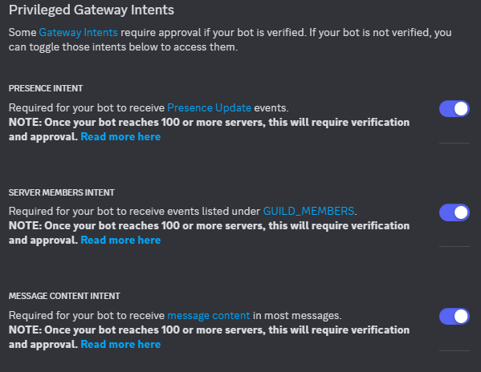

# セットアップ手順
## ディスコードのボットの設定
1. ボットを作成し、intentsをすべてオンにしておいてください。

2. Intentsの設定が終わったら、Discordの認証用のTokenをコピーしてどこかへメモしておいてください。後ほど使います。
## トークンの登録
1. プロジェクトファイルのトップに「.env」という名前のファイルを作成します
2. 作成したファイルを開き、下のように記述します。
```
token=xtSx2Yg*****************************************************************
```
## 実行
1. Denoをインストール([公式サイト](https://deno.com/))
2. ffmpegをインストール
3. Style-Bert-VIT2の`Server.bat`を起動。
4. Server起動後、`deno task run`を実行。

これでディスコードボットが起動するはずです。